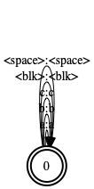
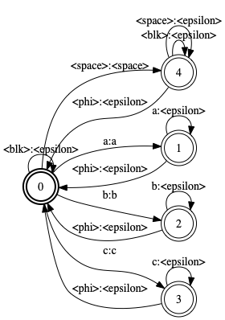
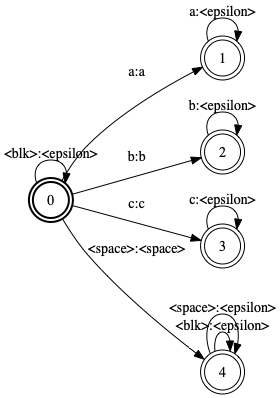
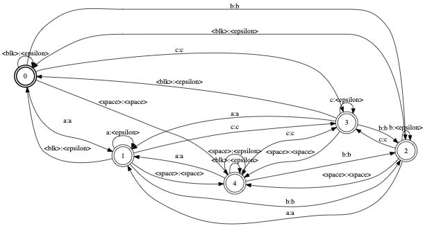
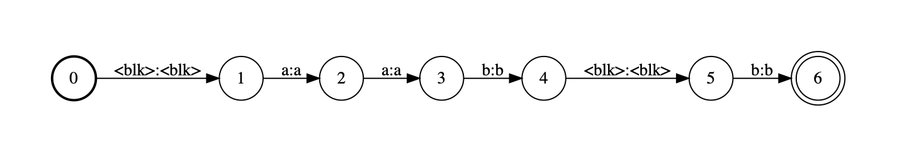
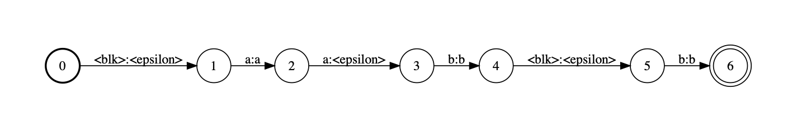

## Composition with Phi-Matcher

Let's create a simple graph.
```bash
fstcompile --isymbols=ascii.syms --osymbols=ascii.syms --acceptor --keep_isymbols --keep_osymbols input.txt input.fst
```



We want to compose above with another graph that has `<phi>` input label, i.e., backoff.
```bash
fstcompile --isymbols=ascii.syms --osymbols=ascii.syms --keep_isymbols --keep_osymbols output.txt | fstarcsort --sort_type=ilabel - output.fst 
```



Simple `fstcompose` yields
```bash
fstcompose input.fst output.fst composed.fst
```



On contrary, phi-matcher composition yields
```bash
./phi_compose input.fst output.fst composed_phi.fst
```



Suppose acoustic input.
```bash
fstcompile --isymbols=ascii.syms --osymbols=ascii.syms --acceptor --keep_isymbols --keep_osymbols acoustic.txt acoustic.fst
```



Generic composition with `output.fst` yields not a viable graph.
Composition with phi-matcher yields.


