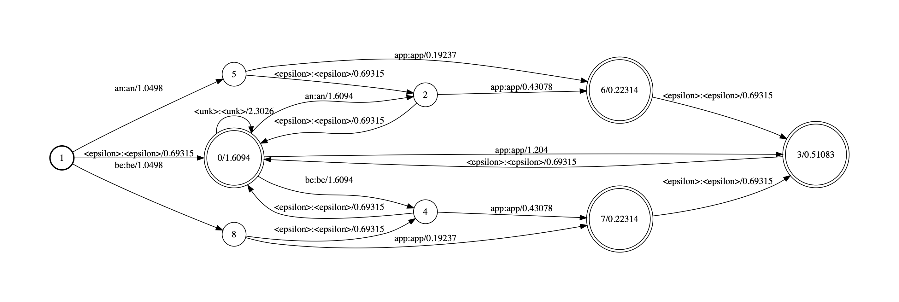
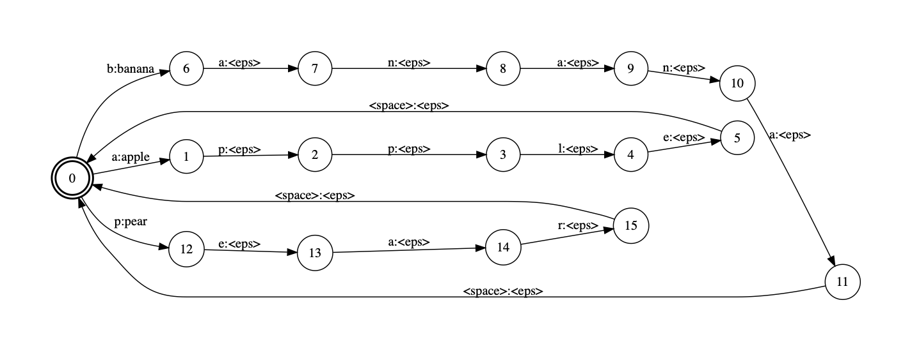

## Creating TLG Graph for CTC Models using OpenFST

### What is TLG?
T stands for token. T graph maps CTC acoustic tokens to characters. 
L stands for lexicon, mapping characters to word. 
G stands for grammar, assigning score for a sequence of words. 
For more details, refer to this [paper]()

#### Token Graph
In CTC, there is a blank symbol `<blk>` which complicates token (T) graph a bit.
Without the blank symbol, T graph will reduce to the following

Essentially, this is just a simple acceptor with all possible tokens.
With blank symbol, the T graph should look like below

Here, `<phi>` represents a back off label; 
we take the `<phi>` arc when there is no matching label.
For example, we transition from state 1 to 0 for any input label but `a`.
The caveat is, at state 0 we again look for transition for the same input label.
That is because `<phi>` does not _consume_ the label.
See [Matchers](http://www.openfst.org/twiki/bin/view/FST/FstAdvancedUsage#Matchers) document in OpenFst for more details.

By convention, `<eps>` represents no-input and no-output.
Say we start from state 0 and get input token sequence `<blk> a a b <blk> b`.
From the T graph above, we will get output token sequence `<eps> a <eps> b <eps> b`.
Removing `<eps>` output tokens, we get `a b b` as expected.

### Expanding Backoff Arcs
What if we want to represent the T graph without any backoff arcs?
Below is the expanded T graph that we want.

Ah, it's a mess, even with just three of 26 alphabet characters.
State 0 is the start state as usual. 
State 1 represents `<space>` character.
State 2, 3, and 4 each represents `a`, `b`, and `c` character, respectively.
As you can see, there is no `<phi>` label.
Every back off transition is explicitly represented by a dedicated transition arcs.

Why would we ever want to represent the T graph in this convoluted form?
For one, OpenFST's shell binary `fstcompose` does not seem to support special matchers,
so if we want to run composition using the shell binary, we should keep it expanded.

Below represents input token sequence `<blk> a a b <blk> b`.

What would happen if we simply `fstcompose` this input with our non-expanded T graph with backoff arcs?
Answer: we get a blank graph, i.e., we can't successfully compose the two
because `<phi>` label is taken as a regular symbol and hence no valid transition at `b` after `<blk> a a` transitions.

What if we compose the expanded T graph with the same input? Viola!

Projecting the output labels and ignoring `<eps>`, we obtain output token sequence `a b b` as expected.
So, the question remains: how do we expand the T graph?
For that, take a look at [phi_compose](../phi_compose) directory.

### Lexicon and Grammar
Suppose simple grammar G below.

Here, `<eps>` represents backoff transition.

We will compose G with two versions of lexicon L graphs. 
In the first case, the L graph and composed LG graph are shown below.

In the second case, the L graph and the composed LG graph are shown below.

In the above case, the `<epsilon>` transitions remain intact
because OpenFST's generic composition treats `<epsilon>` as a special symbol.